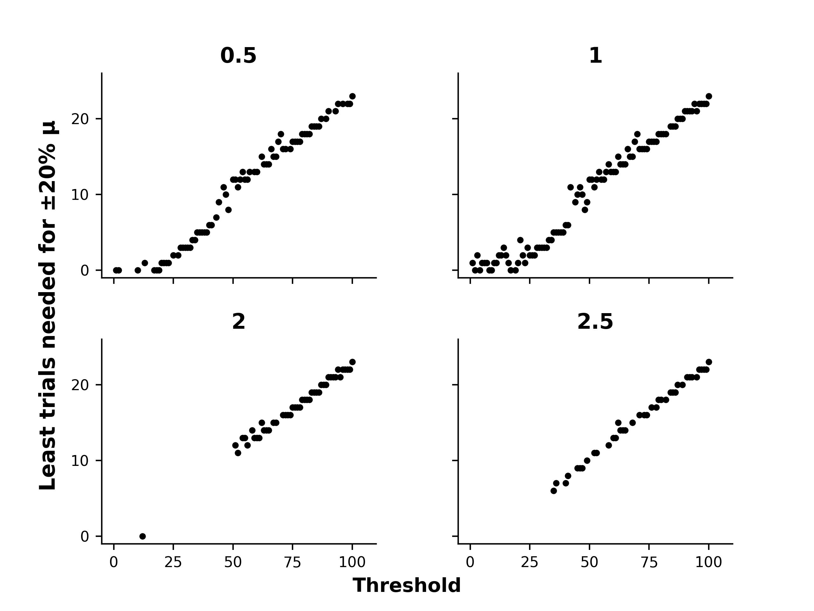
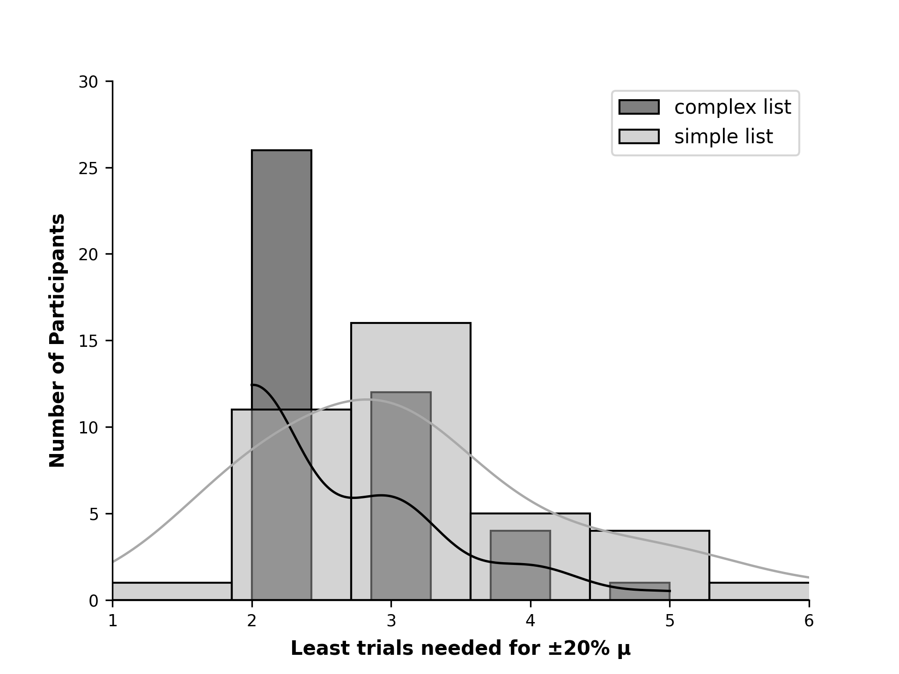
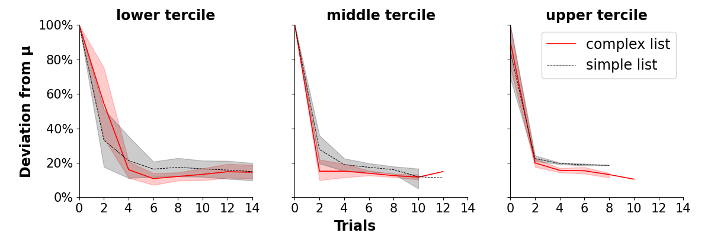
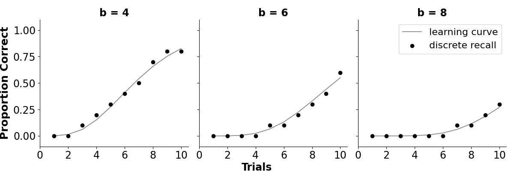
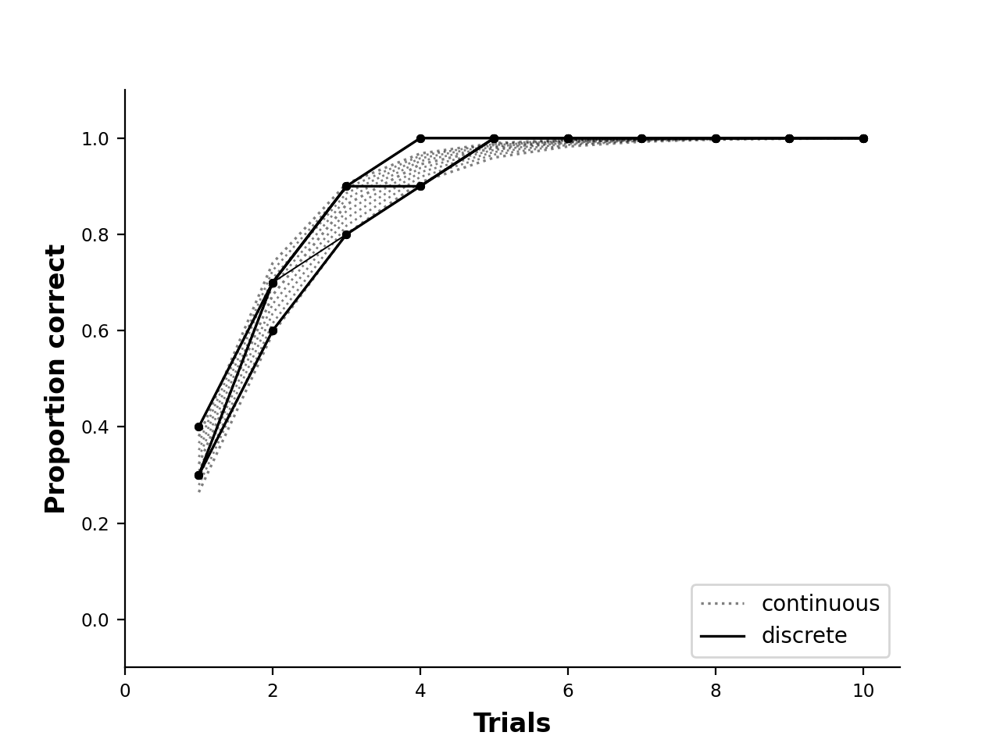

# Bachelors_Thesis

For a copy or questions feel free message me on [LinkedIn](https://www.linkedin.com/in/paul-hosek-pja/)

This is the code for my Bachelor's thesis.
Here, I used maximum likelihood estimation to estimate an individual’s learning rate after a subset of learning.

It is split in several parts:

## Simulation:

To produce a hypothesis, I simulated sigmoid learning curves according to a point-process model of learning.

First, I varied parameters associated with complexity of the learning material and individual learning rate.
In a second step, I used maximum likelihood estimation to retrieve the learning rate based on the material complexity alone.

## Pre-processing:

This is the code that I used to clean the data.

## Analysis

This is code I used to estimate learning rates in a real learning curves from a vocabulary learning task.

**analysis_by_parameter.py** replicates the analysis from the simulation.

**analysis_over_trials.py** analysis how accuracy of learning rate estimates changes over trials/ time.

### Discussion

Entails code to illustrate explanations in the work.

Why there is a linear trend in the simulation.

The effects of discrete recall measures on the accuracy of learning rate estimates.

